# Facial_Recognition_Door_Lock_System

This is my first Git Repository.
 
Author - Shobha Gupta

# Facial Recognition Smart Door Lock using ESP32-CAM And Telegram API 

## Project Overview
This project implements a **Face Recognition-based Smart Door Lock System** using the **ESP32-CAM module**.  
It enhances home and building security by allowing only authorized persons to unlock the door.  
The system integrates **IoT technology**, enabling remote monitoring and control via **Telegram Bot commands**.

### Key Features
- Facial recognition authentication using ESP32-CAM  
- Remote lock/unlock via Telegram app  
- Real-time photo capture and notifications  
- Low power consumption and Wi-Fi connectivity  

##  Background
Security is a major concern in modern homes and workplaces. Traditional locks can be bypassed, but **IoT-enabled smart locks** provide enhanced safety.  
This project leverages **ESP32-CAM with AI-based facial recognition** to create a **keyless entry system**.

## PCB Circuit Design Process
The hardware was designed and fabricated using the following steps:
1. Circuit design on **EAGLE software**  
2. Printing on glossy paper  
3. Lithography process  
4. Chemical etching  
5. Sandpaper finishing  
6. Typing and drilling  
7. Component placement and soldering  
8. Circuit testing  

## Components Used
- ESP32-CAM module  
- 12V 2A Power Supply  
- TIP122 Transistor  
- Resistors (1kΩ, 10kΩ, 330Ω)  
- LED & Buzzer  
- Electronic Solenoid Lock  
- Push Buttons  
- 7805 Voltage Regulator  
- 1N4007 Diode  
- FTDI Programmer  
- Capacitors & PCB Circuit  

## 🖥️ Software & Coding
- **Arduino IDE 2.3.2** used for programming.  
- Code integrates ESP32-CAM with **Telegram Bot API**.  

### Supported Commands
- `/photo` → Capture and send photo  
- `/unlock` → Unlock door  
- `/lock` → Lock door  

## Working Principle
1. ESP32-CAM captures the face image.  
2. Facial recognition algorithm verifies the person.  
3. If authorized → Relay triggers solenoid lock to open.  
4. Notifications and photos are sent via Telegram Bot.  
5. Remote commands allow lock/unlock from anywhere.  

## Practical Demonstration
- Door lock/unlock controlled via Telegram commands.  
- Real-time photo verification ensures security.  
- Multiple photo captures possible if image is unclear.  

## Advantages
- Remote monitoring and control  
- Only authorized access  
- Low power consumption  
- Works over Wi-Fi from any location  

## Limitations
- Dependent on Wi-Fi connectivity  
- Slightly costly compared to traditional locks  
- Mechanical strength of lock base is limited  

## Applications
- **Smart Homes** – Protect children and family members  
- **Smart Buildings** – Prevent burglary and unauthorized access  
- **IoT Security Systems** – Integration with other smart devices  

## Conclusion
This project demonstrates how **IoT and AI-based facial recognition** can be integrated into security systems.  
The ESP32-CAM based smart lock worked successfully in a local environment, providing reliable performance and enhanced security.  

## PCB Fabrication Steps

### 1. Circuit design on **EAGLE software**
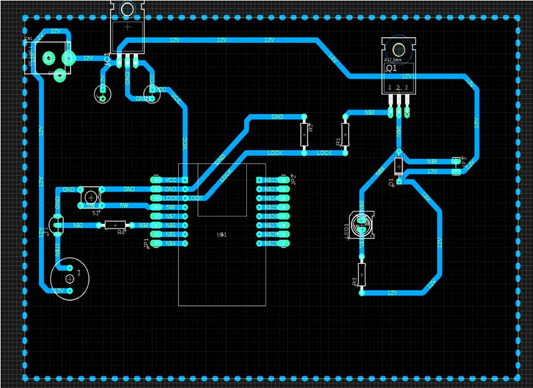

### 2. Printing on glossy paper

### 3. Lithography process
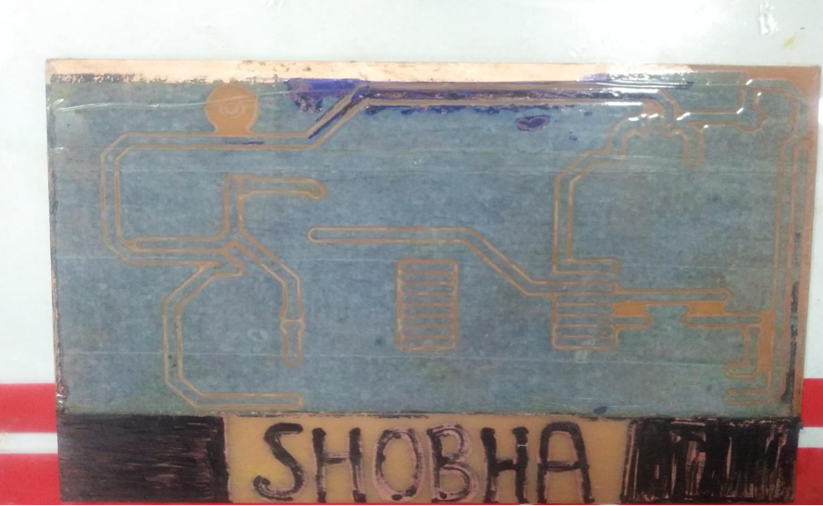

### 4. Chemical etching
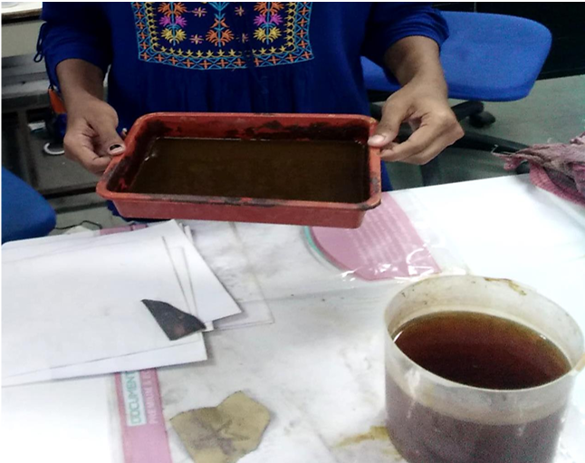

### 5. Sandpaper finishing

### 6. Typing and drilling
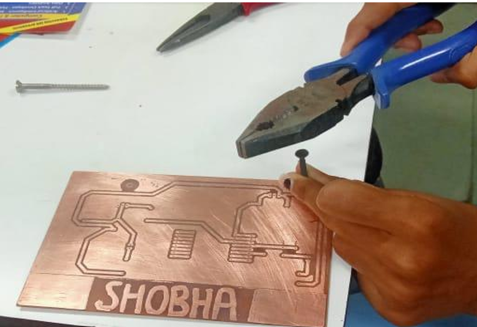
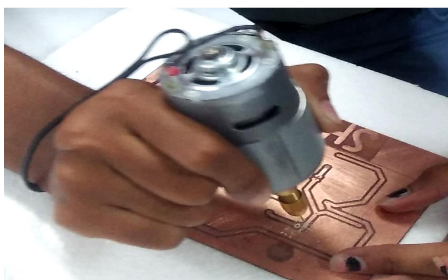

### 7. Component placement and soldering
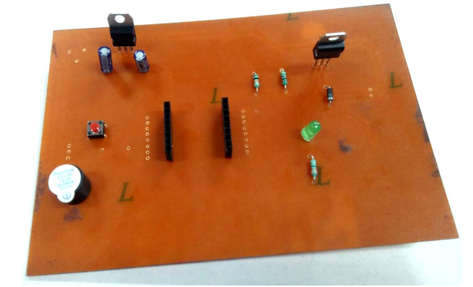
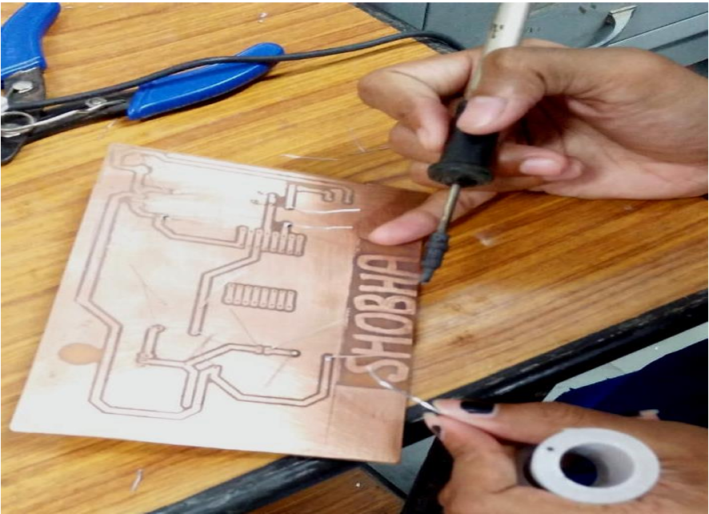

### 8. Circuit testing
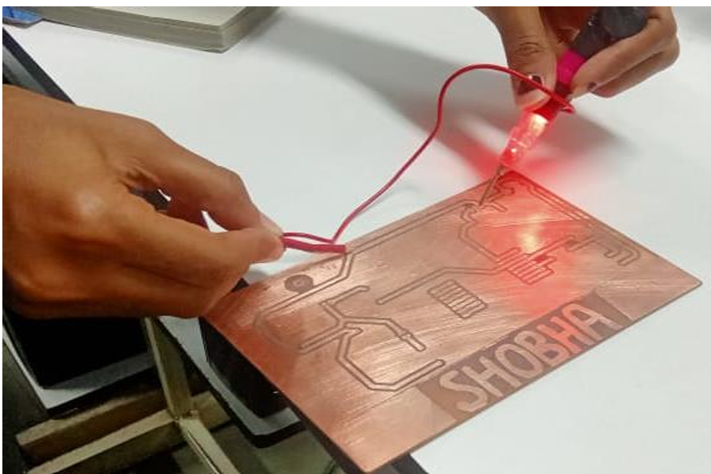

## 🎥 Output Demo

PRACTICAL WORKING 
• If anyone press the bell (Buzzer) then you will receive notification with the picture of that person in telegram 
app.

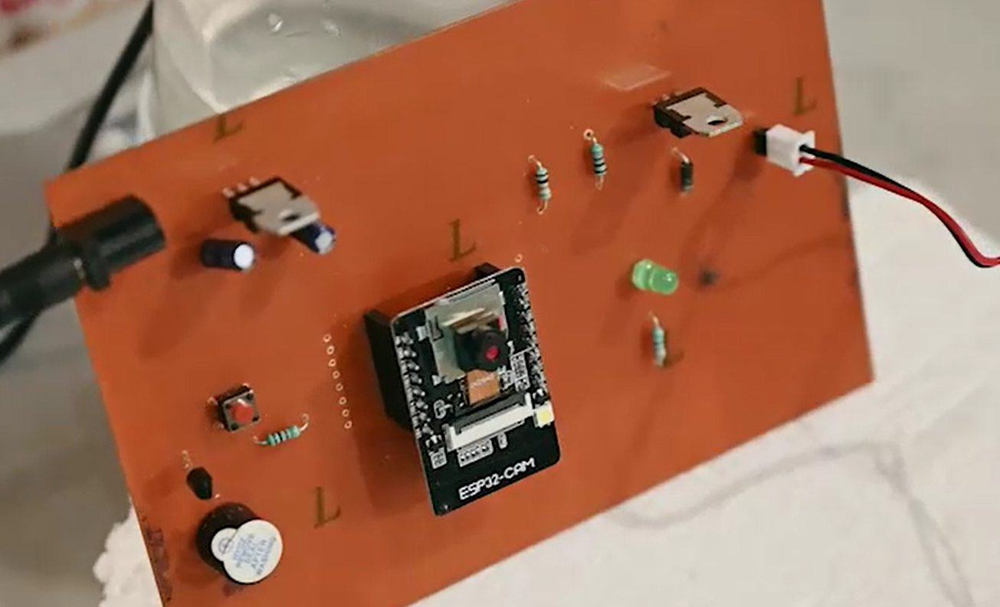

• You can take photos multiple time, if photos are not cleared or blurred.

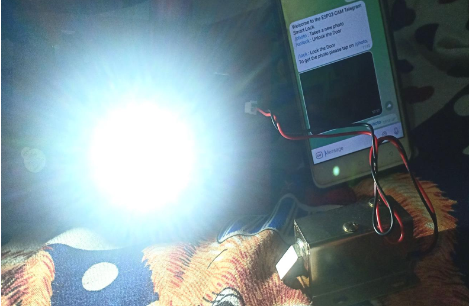

Accordingly, you tab on lock/unlock. 
•  when you tab on unlock, Door open.  
•  when you tab on lock, Door close. 

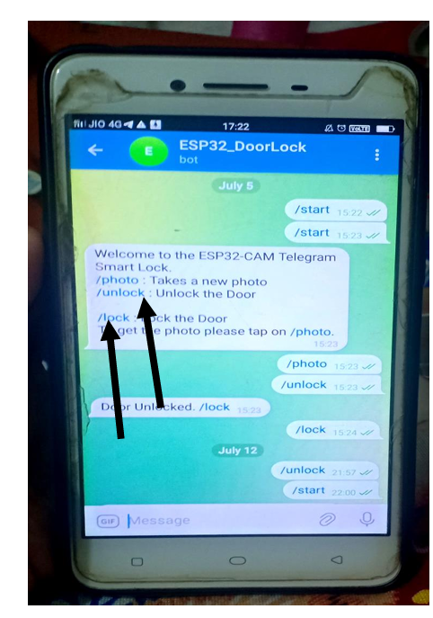

